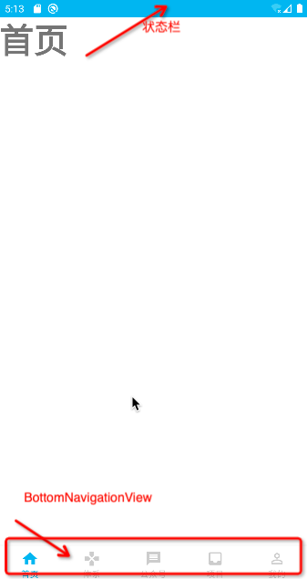

# JetpackWanAndroid

## 简单说明

1. 本项目是学习kotlin的项目用法
2. 本项目全部使用kotlin 包括gradle 也改换使用kts

## 切换 gradle 文件为kts文件

- 项目构建的入口是 settings 所以 先切换settings
- 操作方式：
    1. 复制一份settings.gradle 后缀添加.kts
    2. 设置项目全局仓库依赖
    3. 加载kts脚本支持 直接同步即可
    4. groovy 语法和kts很像 只是kts 换成了方法调用如include kts 使用的是include(":app")
- 跟项目的build.gradle 改造 切换技巧
    1. 重命名build.gradle 文件 后缀加上.kts
    2. 内容 单引号换成双引号 赋值换成等号，其他 化成方法调用 加上（）

- kts 和groovy 最大的区别是 tsak的声明了 kts 需要使用tasks.regist 来注册task

## 抽取gradle配置文件 以做版本控制和依赖版本管理

平时我们做多模块开发 一般都会把一些常用的配置参数 例如版本号 版本名称，依赖版本号等抽取成一个config.gradle 然后在module中apply，如果你现在也按照原来的gradle的思路来
你会惊讶的发现 ext 不存在了 同时出现了一个extra的参数 他的使用方式 网上有很多，在这里不在讨论，我们选择另一种方式 buildSrc 方式
***熟悉gradle的插件的一看到buildSrc 马上就会联想到gralde插件***
这次咱们就是利用了buildSrc的自动配置到项目的每一个module中的特性 来实现共用参数的配置

## 关于gradle 和 kts文件的说明

原本想全部使用kts 但是尝试很久无法实现最终一个文件配置所有module的效果 最终使用了折衷的方式 kts 配合 gradle文件

### 全部使用kts遇到的问题

      1. kts文件声明之后 不能被复写
          例如  配置android的属性时候 每个module 不一样 具体的要复写来实现具体功能 
      2. 现在还存在的问题  android{} 闭包依然不能复写 现在只是使用groovy的动态的特性给每个project 设置了扩展 android{}

### 新建开发分支 dev

### 主页框架搭建

- 主页一个Activity 五个fragment 使用navigation管理fragment
    - Home
    - System
    - bjnews
    - project
    - mine

- 状态栏三方依赖引入 统一状态栏颜色

## MVVM 架构

Model+View+ViewModel+Repository

### 整体架构

#### lib_base

     在这里提供的是 网络 数据库 文件  线程池 图片加载 log等的支持

#### lib_cache

    这里是和数据打交到的 Model ViewModel DB

#### lib_common

    这里是公共的 Base Widget Utils

#### app

    这里是业务模块 所有的业务 基于以上基础服务在这里处理

## 网络封装

- 在lib_base封装网络工具
  - 封装网络请求返回的数据基类   NetResult

      
      